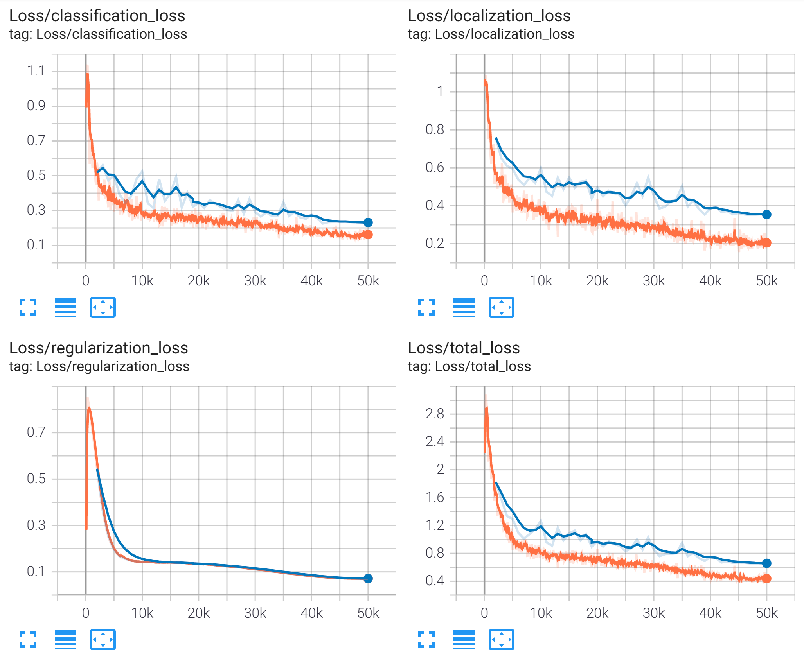
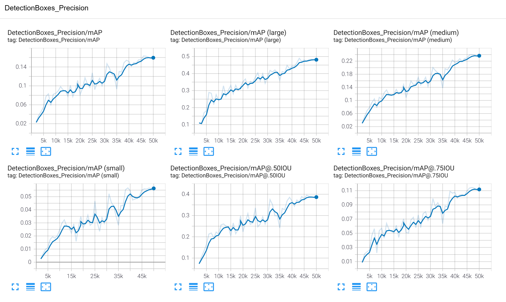
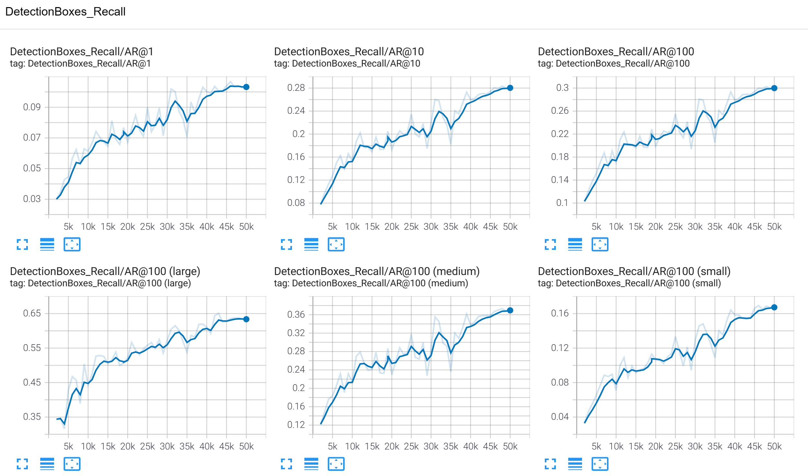
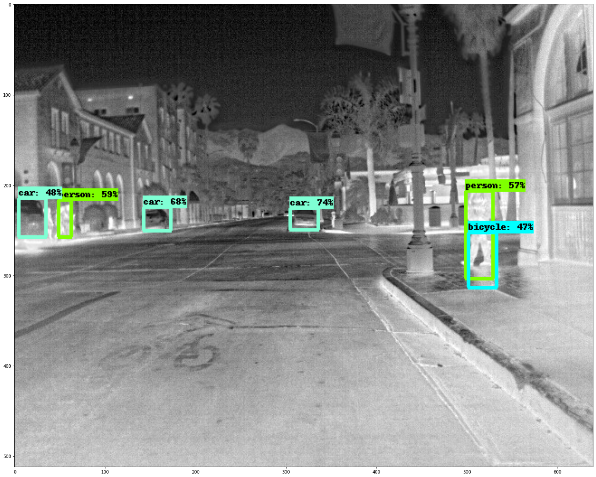

# Rilevamento oggetti con una rete SSD e classificatore MobilenetV2 in Tensorflow
Rilevamento oggetti con una rete SSD e classificatore MobilenetV2 pre-allenata, addestrata con il dataset di immagini stradali termiche [FLIR Thermal Images Dataset](https://www.kaggle.com/deepnewbie/flir-thermal-images-dataset). Si fa uso della Object Dection API di Tensorflow.

La procedura utilizzata si basa sui seguenti riferimenti:
1. [TensorFlow 2 Object Detection API tutorial](https://tensorflow-object-detection-api-tutorial.readthedocs.io/en/latest/index.html), in cui viene descritta l'installazione e l'utilizzo della Object Detection API.
2. [Object Detection Inference on TF 2 and TF Hub](https://colab.research.google.com/github/tensorflow/hub/blob/master/examples/colab/tf2_object_detection.ipynb#scrollTo=2JCeQU3fkayh), dove spiega come eseguire l'inferenza di un modello.
3. [ssd_mobilenet_v2](https://tfhub.dev/tensorflow/ssd_mobilenet_v2/2), da cui si ottiene il modello pre-allenato.
4. [TensorFlow Object Detection API: Best Practices to Training, Evaluation & Deployment](https://neptune.ai/blog/tensorflow-object-detection-api-best-practices-to-training-evaluation-deployment), un altro link utile.

Si utilizza la Object Detection API di Tensorflow. All'interno della cartella di progetto deve essere già presente il contenuto pronto con il dataset già convertiro in formato TFRecord, il modello pre-allenato, ed il file label_map.pbtxt necessario all'algoritmo. 
La struttura della cartella che il processo si aspetta è la seguente:

```bash
└── tensorflow
    ├── annotations
    │   ├── coco_train.record-00000-of-00001
    │   ├── coco_val.record-00000-of-00001
    │   └── label_map.pbtxt
    ├── exported-models/my_model
    ├── images
    │   ├── train
    │   └── val
    ├── models/my_ssd_mobilenet_v2
    │   └── pipeline.config
    ├── pre-trained-models/ssd_mobilenet_v2_320x320_coco17_tpu-8
    │   └── pipeline.config
    ├── create_coco_tf_record.py
    ├── exporter_main_v2.py
    └── model_main_tf2.py
```
Qui viene descritto l'utlizzo di ogni cartella:
1. annotation: sono presenti i file tfrecord che usa tensorflow per gestire il dataset. Inoltre, è presente la mappa delle etichette personalizzata con le quattro classi del nostro modello.
2. images: sono raccolte le immagini del dataset con il file json delle annotazioni in formato mscoco
3. annotation/models/my_ssd_mobilenet_v2: contiene i file evento, i checkpoint e il file di configurazione della pipeline
4. pre-trained-models/ssd_mobilenet_v2_320x320_coco17_tpu-8: il modello pre-allenato ottenuto da TensorHub
5. create_coco_tf_record.py converte le annotazioni in formato mscoco in tfrecord. Copiato da [Tensorflow Model Garden](https://github.com/tensorflow/models/blob/master/research/object_detection/dataset_tools/create_coco_tf_record.py)
6. model_main_tf2.py: esegue addestramento e valutazione
7. exporter_main_v2.py: esporta il modello

I parametri dell'addestramento vengono inseriti nel file di configurazione 'models/my_ssd_mobilenet_v2/pipeline.config'.

Una volta eseguita le installazioni richieste nel tutorial ed ottenuta la struttura appena descritta, si passa con la preparazione del dataset.

## Conversione del dataset in TFRecord
Il formato del dataset è MSCOCO. Tensorflow usa il formato TFRecord, perciò è necessario eseguire la conversione.

        python create_coco_tf_record.py --logtostderr \
        --train_image_dir="images/train" \
        --val_image_dir="images/val" \
        --test_image_dir="images/val" \
        --train_annotations_file="images/train/thermal_annotations.json" \
        --val_annotations_file="images/val/thermal_annotations.json" \
        --testdev_annotations_file="images/val/thermal_annotations.json" \
        --output_dir="annotations"

## Rimozione degli esempi senza annotazioni
Nel notebook Jupyter 'remove_records_without_annotations.ipynb' è descritta la procedura per eliminare gli esempi di cui non si possiedono le annotazioni. Si è visto infatti, che le metriche migliorano leggermente se non si inseriscono tali esempi nella procedura di addestramento.

## Parametri
L'API utilizza un file in cui vengono elencati tutti i parametri di addestramento tra cui la dimensione del batch, il learning rate e il suo pianificatore (cosine_decay_learning_rate).
Si è deciso di lasciare i parametri di allenamento della rete pre-allenata cambiando solo la dimensione del batch e il numero di passi (50000). 

### Differenza tra passi ed epoche
Tensorflow indica lo scorrere dell'addestramento con gli step invece che con le epoche. Una epoca è il numero di passi che impiega la rete in allenamento a ricevere una volta tutte le immagini del dataset. Per sapere quanti passi corrisponde un'epoca si usa la formula seguente
    
    steps = (epochs * examples) / batch_size

Quindi, con <code>steps=50000</code>, <code>examples=7760 </code>e <code>batch_size=64</code>, abbiamo poco più di 400 epoche.

Nello stesso file, si indicano anche il numero di classi e la posizione dei TFRecord.

## Avvio dell'addestramento
Il ciclo di addestramento è contenuto nello script model_main_tf2.py. Serve indicare la cartella in cui salvare il modello e il file di configurazione pipeline.config.

    python model_main_tf2.py --model_dir="$PATH_TO_MODEL" --pipeline_config_path="$PATH_TO_MODEL/pipeline.config"

## Valutazione
La validazione viene eseguita richiamando lo stesso script ma aggiungento la cartella dei checkpoint come parametro. In questo caso i checkpoint vengono generati nella stessa cartella del modello. 

Lo script esegue la valutazione dall'ultimo checkpoint del modello, al termine, rimane in attesa per 300 secondi, al termine del quale controlla l'aggiunta di nuovi checkpoint. Una volta individuato un nuovo checkpoint esegue una nuova valutazione. La valutazione va eseguita in un processo parallelo. In questo caso si è sfruttata la CPU per eseguire la valutazione in parallelo alla GPU cimpegnata nell'addestramento. Per farlo si apre un nuovo terminale, si indica di usare la CPU e si avvia il comando

    CUDA_VISIBLE_DEVICES="" 
    python model_main_tf2.py \
    --model_dir="models/my_ssd_mobilenet_v2" \
    --pipeline_config_path="models/my_ssd_mobilenet_v2/pipeline.config" \
    --checkpoint_dir="models/my_ssd_mobilenet_v2"

I risultati possono essere visualizzati, oltre che dall'output della cella, anche aggiornando la pagina aperta di Tensorboard.

## Tensorboard
Tensorboard è uno strumento per poter visualizzare le metriche del modello. Funziona leggendo i file di evento che vengono generati durante l'addestramento e durante la validazione.

    tensorboard --logdir="tensorflow/models"

Si può utilizzare sia per seguire l'addestramento che al termine per visualizzazione.

## Esportazione
Al termine si esporta il modello in formato daved_model di Tensorflow.

    python exporter_main_v2.py \
    --input_type image_tensor \
    --pipeline_config_path "$PATH_TO_MODEL/pipeline.config" \
    --trained_checkpoint_dir "$PATH_TO_MODEL" \
    --output_directory "exported-models/my_model"

## Risultati
I risultati ottenuti sono in linea con quelli di altri studi come nel seguente: [Object Detection Using Thermal Imaging](https://ieeexplore.ieee.org/document/9342179).







